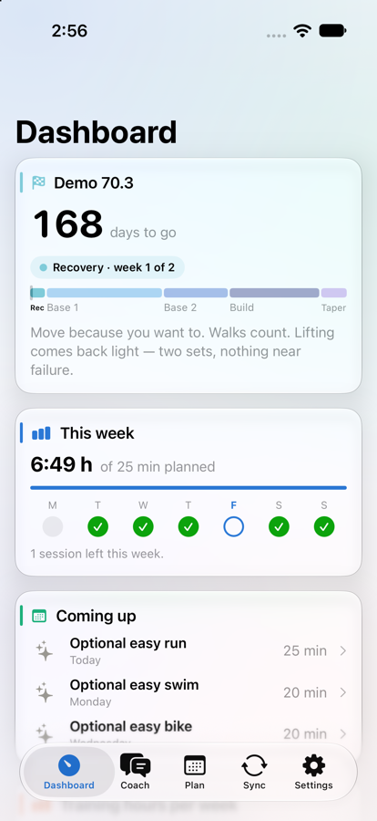
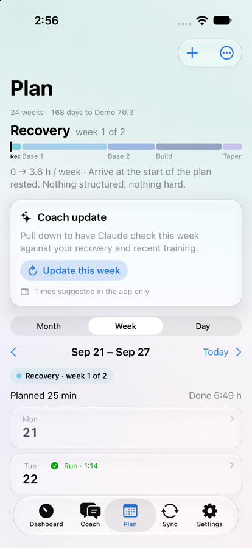

# Coach Bridge

A native iPhone training companion for endurance athletes. Coach Bridge reads your training and
recovery data, builds a periodised plan toward your race, adapts it with an LLM coach, and keeps
your data yours: read-only access, stored on the device, exported only where you choose.

<p align="center">
  
  &nbsp;&nbsp;
  
</p>

<p align="center"><sub>Screenshots use the app's demo mode. Every number shown is generated.</sub></p>

---

## Contents

- [Features](#features)
- [Architecture](#architecture)
- [Privacy and security](#privacy-and-security)
- [Getting started](#getting-started)
- [Development](#development)
- [Project status](#project-status)
- [Documentation](#documentation)

## Features

**Training dashboard.** The first screen shows where you are in the season: days to the race,
the current phase and week, the whole plan as a ribbon, this week's hours against the plan, and
the next sessions. Below it, a Today section shows today's sessions, a recovery signal and the
day's metrics, followed by the resting heart rate and HRV trends.

**A plan built from your profile.** You describe your event, available hours, training days,
equipment and goal. The plan is counted backward from race day through recovery, base, build and
taper phases, with recovery weeks built in. Phases appear throughout the calendar: in a season
ribbon, as color bands across the month view, and as all-day banners in Apple Calendar.

**Edit any session in place.** Every field of every session can be changed with a tap. Editing
a planned session makes it yours: it stays where you put it, and the coach plans the rest of the
week around it.

**An LLM coach that costs only what you use.** It adjusts the coming week against your recent
data, can change the plan from chat (applied only after you confirm), and writes a note on each
completed workout. Every model response is validated and clipped before use. Requests are
deliberate and rate-limited, and nothing calls the model just because a screen opened.

**Schedule sync.** Sessions are placed around your existing calendar events in a dedicated Training
calendar and sent to Apple Watch as structured workouts through WorkoutKit.

**The original bridge.** Once a day the app writes a JSON summary of your health metrics to a
folder in your own Google Drive, for other tools to read. The format is a fixed contract,
documented in [`docs/data-contract.md`](docs/data-contract.md).

**Demo mode.** Fills the app with generated data so it can be shown without an Apple Watch or any
Health history. Demo data never reaches Drive, and the coach is told the numbers are not real.

## Architecture

SwiftUI, iOS 18+, iPhone only. One Swift package dependency:
[GoogleSignIn-iOS](https://github.com/google/GoogleSignIn-iOS). No analytics or crash reporting.

```
CoachBridge/
  Model/    Pure value types and logic: the plan engine, scheduler, data contract.
            No UI, no I/O, no clock reads; dates take an injected Calendar. Unit-tested.
  Health/   HealthSource protocol, the HealthKit readers behind it, demo data
  Drive/    Google sign-in (drive.file scope), Drive REST client, daily exporter
  Coach/    LLM clients, prompt construction, observable models, calendar and Watch sync
  App/      SwiftUI views, theme and palette
```

**Data sources.** Everything the app reads comes through the `HealthSource` protocol. Apple Health
is the first implementation; other sources, such as FIT file import, plug in as further
conformances without changes to the rest of the app.

**Plan pipeline.**

```
AthleteProfile → PlanBlueprint → PlanEngine → Prescriber → PlanModel
 (your input)    (phases,         (commitments,  (targets,     (athlete edits, coach
                  backward from    blackouts,     fuelling)     changes, persistence)
                  race day)        rules)
```

**LLM access.** The `LLMClient` protocol has two operations, streaming chat and forced tool
calls. Anthropic is the primary provider; an OpenAI client and a hosted-server client share the
same interface. Each provider's API key is stored separately in the Keychain.

## Privacy and security

Health data is sensitive. These are design constraints, and the code is built to uphold them:

- **Read-only Health access.** The app requests no HealthKit write permissions, and a test fails
  if any are added.
- **Least-privilege Google access.** The only scope is `drive.file`, so the app can see only files
  it created.
- **Encrypted at rest.** Local caches, chats and your edits are written with
  `.completeFileProtection`, so they're unreadable while the phone is locked. API keys are stored
  in the Keychain. Nothing goes to iCloud.
- **Nothing sensitive in logs.** Logs record counts and status, never metric values.
- **Explicit sharing.** The coach receives a health summary only when "Share my Health summary" is
  on. The exact prompt can be viewed from the chat screen.
- **Untrusted input is sanitised.** Anything typed into a session is length-capped and stripped
  of control characters before it reaches the model prompt, the calendar or the Watch.
- **No third-party analytics.** The only services contacted are Google Drive, your LLM provider
  and the weather service.

Strava is deliberately not integrated: its API terms prohibit using API data with AI models.

## Getting started

### Requirements

- macOS with Xcode 26 or newer (the app uses the iOS 26 SDK and runs on iOS 18+)
- [XcodeGen](https://github.com/yonaskolb/XcodeGen): `brew install xcodegen`
- An Apple Developer Program membership for builds that last longer than 7 days and for
  background delivery. A free Personal Team works for short-term testing.
- Optional: a Google Cloud project for Drive export, and an Anthropic or OpenAI API key for the
  coach

### Build and run

```bash
git clone https://github.com/BnguyenInfoSec/CoachBridge.git
cd CoachBridge
cp Config/Secrets.example.xcconfig Config/Secrets.xcconfig   # then fill it in (below)
xcodegen generate
open CoachBridge.xcodeproj
```

`CoachBridge.xcodeproj` is generated from `project.yml` and is not checked in. Re-run
`xcodegen generate` after adding or removing files.

### Configuration

`Config/Secrets.xcconfig` is git-ignored and holds per-developer values:

| Key | Purpose |
|---|---|
| `DEVELOPMENT_TEAM` | Your Apple team ID. Keep it here rather than in Xcode's signing UI, which `xcodegen generate` resets. |
| `BUNDLE_ID_PREFIX` | Reverse-DNS prefix for the bundle ID. Choose it before creating the Google OAuth client. |
| `GOOGLE_CLIENT_ID` | iOS OAuth client ID from Google Cloud. |
| `GOOGLE_REVERSED_CLIENT_ID` | The same ID in reversed URL-scheme form. |

> **Keep the team ID stable.** Keychain items are tied to the signing team. If a build is signed
> by a different team, iOS treats it as a different app and the stored API key is lost. Deleting
> the app from the phone clears the Keychain as well.

The app builds and runs with placeholder Google values; only Drive sign-in is unavailable.

### Google Drive export (optional)

1. In the [Google Cloud console](https://console.cloud.google.com), create a project and enable the
   **Google Drive API**.
2. Under **Google Auth Platform**, set the app name and contact email. Set the audience to
   **External** and publish the app. In *Testing* status, Google expires refresh tokens after
   7 days, which stops the daily export.
3. Add exactly one scope: `https://www.googleapis.com/auth/drive.file`. It is non-sensitive, so no
   Google verification is needed. Users see an "unverified app" notice once.
4. Create an **iOS** OAuth client with bundle ID `<BUNDLE_ID_PREFIX>.CoachBridge`. iOS clients have
   no client secret.
5. Copy the client ID and reversed client ID into `Secrets.xcconfig`, then regenerate the project.

### LLM coach (optional)

Create an API key with [Anthropic](https://console.anthropic.com) or
[OpenAI](https://platform.openai.com), paste it in **Settings → Model provider**, and set a monthly
spend limit in that provider's console. An LLM subscription such as Claude Pro does not include
API access. Never build an API key into the app: anyone with the binary can extract it.

## Development

### Build and test

```bash
xcodegen generate
xcodebuild -scheme CoachBridge -destination 'generic/platform=iOS' CODE_SIGNING_ALLOWED=NO build
xcodebuild -scheme CoachBridge -destination 'platform=iOS Simulator,name=iPhone 17' test
```

The suite has 184 tests and runs in about a second. It covers the data contract, the plan engine
(swept across every runway from 4 to 208 weeks), scheduling, input sanitisation, phase display, and
demo-mode isolation using a fake `HealthSource`. Any installed iPhone simulator works.

### Running in the simulator without Health data

Launch arguments override stored defaults without saving them:

```bash
xcrun simctl launch <simulator-udid> <bundle-id> -demo.enabled YES -onboarding.completedVersion 3
```

### Conventions

- Keep logic in `Model/` as pure functions with an injected `Calendar`, so it can be tested
  without a device.
- Comments explain *why*: the bug that prompted the code, or the trade-off taken.
- Every iOS 26 API lives in `App/Theme.swift` behind an availability check, with a fallback for
  iOS 18.
- One fix per commit, with a message that explains the reason.

## Project status

Personal project in active development, currently **v2.8.0**. Distributed by direct Xcode install,
with TestFlight planned.

Verified on device: HealthKit reads, Drive export, background delivery, the dashboard, chat, the
plan calendar, calendar sync and weather.

Not yet verified:

- Apple Calendar phase banners and WorkoutKit sync since the v2.0 plan rewrite
- The OpenAI provider; the hosted-server client is a stub
- Coaching quality: the plan engine is tested for structure, not for whether its weeks are good
  training, and the workout-review prompt hasn't yet been run against a live model
- A privacy policy, which is required before external TestFlight testing

App Store guideline 5.1.3 restricts sharing HealthKit data with third parties. A public release
would need explicit consent flows for the LLM and Drive features.

## Documentation

| Document | Contents |
|---|---|
| [`CHANGELOG.md`](CHANGELOG.md) | Development history: what changed in each version, and why |
| [`docs/data-contract.md`](docs/data-contract.md) | The daily JSON export format (fixed; external consumers depend on it) |
| [`AGENT-HANDOFF.md`](AGENT-HANDOFF.md) | In-depth architecture, invariants and project context for contributors |
| [`CLAUDE.md`](CLAUDE.md) | Condensed working rules for AI coding agents |
