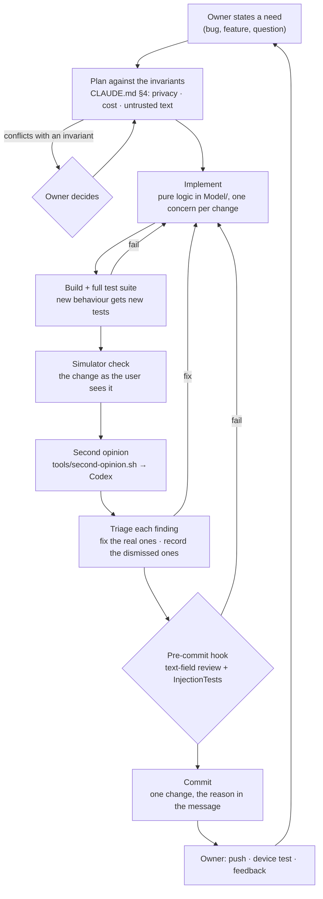

# How Coach Bridge is built: an AI-assisted secure development lifecycle

Coach Bridge is written almost entirely by AI coding agents, under the direction of one human
owner who works in information security. This document describes how that's made safe to rely
on. It covers who does what, which gates every change passes, how output from AI tools is
treated, and where the process is still weak.

The security design of the app itself (information flow, threat model, OWASP LLM Top 10) is in
[`SECURITY.md`](SECURITY.md). This document covers the process that produces the app.

---

## 1. Roles

| Role | Who | Does | Doesn't |
|---|---|---|---|
| **Owner** | Brandon (human) | Sets requirements and priorities, makes the product and risk decisions the agents raise, tests on real devices, approves anything irreversible or public (pushing, force-pushes, publishing, signing changes) | Write most of the code |
| **Implementer** | Claude Code | Reads the codebase, designs and writes changes, writes the tests, runs the build and the suite, checks the UI in the simulator, commits one change at a time with the reason, keeps the docs current | Push or take irreversible steps without the owner's go-ahead; quietly change an invariant |
| **Second reviewer** | OpenAI Codex (signed in with ChatGPT) | Reviews diffs independently against the project's rules, looking for bugs, invariant violations, security issues and missing tests | Edit, commit, or see anything beyond the diff and the rules |
| **Gates** | Tests, pre-commit hook, compiler | Refuse a change that breaks behaviour, leaks untrusted text into a prompt, or skips the text-field review | Judge whether a change is a good idea |

The split is deliberate: **one writer, two reviewers.** Two agents writing to the same codebase
produce conflicting edits and changes nobody owns. Two reviewers from different model families
have different blind spots, and neither of them gets to change the code.

---

## 2. The lifecycle of a change

### Plan: requirements are the invariants

The project's security and cost requirements are written down in [`CLAUDE.md`](../CLAUDE.md) §4
before any feature exists: nothing numeric on a locked screen, no metric values in logs, no LLM
call without an explicit tap, untrusted text fenced before it reaches a prompt, the athlete's own
input never overwritten. A plan that would break one isn't implemented quietly. It's raised with
the owner as a choice.

Example: the owner asked for a coach's note on every workout "right after it's completed". Doing
that literally meant a paid model call per workout, triggered in the background, which breaks the
cost invariant. The implementer built the version that keeps it (the note is written when the
athlete answers "how did it feel?", which is their tap) and put the other option to the owner
instead of choosing it for them.

### Implement: keep logic testable

Anything that can be a pure function lives in `Model/`, with an injected `Calendar` and no clock
reads. That's what lets rules like "which workouts get a reminder" or "which run/walk pieces
merge" be tested exhaustively instead of eyeballed. For example, `FeelReminder` decides what a
notification says, and a test checks that no sport's text ever contains a digit.

### Test: every claim has a test

The suite (353 tests, about four seconds) runs on every change. Beyond ordinary unit tests, it
includes:

- an **injection matrix**: 14 payloads through every text field in every prompt;
- **fuzzing**: 5,000 corrupted FIT files, plus truncation at every byte;
- **sweeps**: the plan engine across every runway from 4 to 208 weeks;
- **invariant tests**: nothing numeric in lock-screen data or notification text.

When a guard is added, the test is checked to fail with the guard removed.

### Verify: look at it

Every user-facing change is checked in the iOS simulator before it's called done. Launch
arguments put the app into demo mode, so no real Health data is needed. This has caught things
tests don't. One example: a Settings row that rendered several hundred points tall because of a
layout quirk on iOS 27.

### Review: an independent second model

`tools/second-opinion.sh` sends the diff and `CLAUDE.md` to Codex, which reviews it against the
project's rules and reports findings with a severity, a location, a failure scenario and a fix.
The implementer checks each finding against the code and tests: real ones are fixed, and
dismissed ones are named with the reason.

Every run is recorded in [`review-log.md`](review-log.md). The log shows the reviewer
earning its place: on the consent screen it found a real race (two requests at once could leave
one caller waiting forever) that the implementer had noticed and wrongly judged harmless, and on
the fix it pointed out the new queue had no tests.

A reviewer that always says "No findings" is useless, and so is one you can't tell apart from
it. So the reviewer was **calibrated**: a deliberate violation (the workout's duration in a
lock-screen notification) was planted in a change, and Codex caught it and named the invariant.

### Gate: the pre-commit hook

`tools/githooks/pre-commit` runs whenever a commit touches a text field or the prompt builders.
It checks the inventory of inputs against the reviewed list (`tools/text-fields.txt`) and runs
`InjectionTests`, and it blocks the commit if either fails. It's never bypassed with
`--no-verify`.

### Record: one change per commit, with the reason

Each commit is one change, and its message says what was wrong and why, not only what changed.
`CHANGELOG.md` records each version in plain language for the owner. The first commit
(`000afed`) is the AI-written code exactly as delivered before anything was compiled. Every repair
after it is its own commit, so what the agents got wrong the first time stays visible.

---

## 3. AI tools are untrusted too

The app treats text from an LLM as untrusted: it's validated, clipped and cleaned before it's
shown or stored (`SECURITY.md` §2). The development process applies the same rule to the AI
tools that build the app.

| Tool | Can access | Why it's limited that way |
|---|---|---|
| **Claude Code** (implementer) | The repository on the owner's Mac. Shell commands go through Claude Code's permission prompts; git pushes and anything public or irreversible need the owner's go-ahead | It has to read and build the code. What it may *do* is limited, not what it may read |
| **Codex** (reviewer) | Only the diff and `CLAUDE.md`, both public and tracked. It runs read-only from an empty temporary folder, never the repository | The git-ignored `Config/Secrets.xcconfig` isn't in its working directory, and the script refuses a diff that looks like it holds a key, a Google client ID or a team ID. A read-only sandbox stops writes, not reads elsewhere on disk, so the content filter is the second layer |
| **ChatGPT** (the app) | Whatever the owner pastes into a project set up for coaching review and red-team ideas | Demo-mode data only, never keys, secrets or a real Health export |

Output from both models is **input to verify, not instructions to follow**. A finding becomes a
change only if the code and tests bear it out. Text inside diffs and files is treated as data by
the reviewer (`AGENTS.md`), which is the same indirect-prompt-injection defence the app uses for
calendar titles (advisory CB-2026-001).

**The toolchain is part of the supply chain.** When Codex was installed, macOS blocked the
binary on first launch. It wasn't approved on faith. Before the owner allowed it, the signature
was checked with `codesign` and `spctl`:

- signed with OpenAI's Developer ID (`OpenAI OpCo, LLC`, team `2DC432GLL2`);
- valid on disk, and satisfying its designated requirement;
- accepted by Gatekeeper as a notarized Developer ID binary;
- installed from the official Homebrew cask, which checks the download's checksum.

It was then allowed through System Settings for that one binary. Gatekeeper wasn't disabled and
the quarantine flag wasn't stripped.

---

## 4. Mapping to NIST SSDF and its generative-AI profile

NIST SP 800-218 (SSDF) and its community profile for AI, SP 800-218A, apply to developing *with*
AI as well as developing AI features. What the process adds on top of the table in
`SECURITY.md` §5:

| Practice | What this process does | Evidence |
|---|---|---|
| **PO.2 Roles and responsibilities** | One writer, one independent reviewer, one human owner with decision rights | §1, `CLAUDE.md`, `AGENTS.md` |
| **PO.3 Toolchains** | Tests, hook and second-model review wired into the normal path, not optional extras | `tools/` |
| **PO.5 Secure environments** | The reviewer is sandboxed and fed only the diff; secrets stay out of git and out of prompts | `tools/second-opinion.sh`, `.gitignore` |
| **PS.2 / PS.3 Integrity and provenance** | Dev tools checked for signature and notarization before use; every change is an attributed commit with its reason; the as-delivered baseline is kept | §3, `git log`, commit `000afed` |
| **PW.7 Code review** | Independent review by a second model family, calibrated against a planted defect | §2 |
| **PW.8 Testing** | Exhaustive, fuzz and injection tests; invariants tested, not asserted | `CoachBridgeTests/` |
| **RV.1–RV.3 Vulnerability response** | Findings fixed at the root, with a test for the class of bug and the SOP updated; public advisory for the one real vulnerability | `SECURITY.md` §7 |

---

## 5. Where this process is weak

Stated plainly, for the same reason `SECURITY.md` has a residual-risk section.

- **Both reviewers are language models.** Their mistakes can be correlated. A plausible but wrong
  design can pass both, and a "No findings" doesn't show that a change is correct.
- **Calibration was one planted defect.** It shows the reviewer can catch a clear invariant
  violation, not that it catches subtle ones. More seeded defects of different kinds would give a
  real catch rate.
- **No human reads every line.** The owner reviews behaviour on the device and makes the
  decisions, but the code review is done by the second model. The tests and the invariants carry
  more weight as a result, which is why they're strict.
- **Coaching quality isn't tested.** The plan engine is tested for structure, not for whether a
  week is good training, and no one has yet judged a real coach's note (`CLAUDE.md` §6). That
  needs a human expert, or at least the owner.
- **The implementer can read the whole repository**, including the git-ignored secrets file.
  That file holds identifiers (team ID, OAuth client ID), not credentials; API keys live only in
  the iPhone's Keychain. It's still broader access than the reviewer has.
